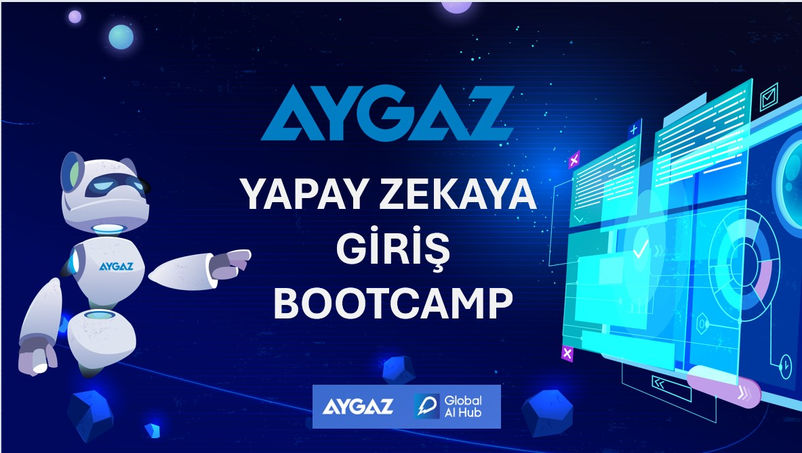

<h1> Aygaz Yapay Zekaya Giriş Bootcamp</h1>
  <h2> Aygaz Yapay Zekaya Giriş Bootcamp Final Projesi </h2>
  
 Proje PDF: <a href="Aygaz.Bootcamp.pdf" download>Aygaz Yapay Zeka Bootcamp PDF </a>

  </a>

 <h2> Proje </h2>

  
 Bu proje, Aygaz ve Global AI Hub işbirliğinde 06.06.2024 – 22.06.2024 tarihleri arasında düzenlenen "Aygaz Yapay Zekaya Giriş Bootcamp" kapsamında gerçekleştirilen bir final proje çalışmasıdır.

 <h2> Projenin Amacı </h2>
  
Projenin amacı, Fashion MNIST veri seti kullanılarak giyim eşyalarının doğru bir şekilde görüntü sınıflandırılmasını sağlamaktır. Bu kapsamda Evrişimli Sinir Ağları (CNN) mimarisi kullanılarak bir model oluşturulmuştur. Modelin performansı çeşitli metrikler kullanılarak değerlendirilmiştir.

 <h2> Materyal – Metod </h2>
  

   <ul>
     <li><b>Veri Seti:</b> Fashion MNIST</li>
     <li><b>Kütüphaneler:</b>NumPy, Matplotlib, TensorFlow, Seaborn, Sklearn</li>
     <li><b> Model:</b> Evrişimli Sinir Ağı (CNN) </li>
     <li> <b> Değerlendirme Metrikleri: </b> Karmaşıklık Matrisi, Sınıflandırma Raporu, ROC Eğrisi ve AUC Değerler.</li>
   </ul>
  

 <h2> Veri Seti Hakkında Bilgi</h2>
 
 Fashion MNIST, 60,000 eğitim ve 10,000 test örneği içeren veri 
setidir.

 
 
  <ul>
   <li><b>Görüntü Boyutu:</b> 28x28 gri tonlamalı görüntülerdir.</li>
   <li><b>Sınıflar:</b> T-shirt, Pantolon, Kazak, Elbise, Ceket, Sandalet, Gömlek, Spor Ayakkabı, Çanta, Bot. </li>
  </ul>
 

<h2> Veri Görselleştirme </h2>
 
 Eğitim veri setinden örnek veri görselleştirme görüntüsü (10 adet):

 

 <h2> Model Mimarisi </h2>
  

   <ul>
    <li> <b> Katman 1: </b> 32 filtreli, 3x3 boyutunda Conv2D, ReLU aktivasyonu  </li>
    <li> <b> Katman 2: </b> 2x2 MaxPooling2D  </li>
    <li> <b> Katman 3: </b>  64 filtreli, 3x3 boyutunda Conv2D, ReLU aktivasyonu  </li>
    <li> <b> Katman 4: </b> 2x2 MaxPooling2D  </li>
    <li> <b> Katman 5: </b> Flatten  </li>
    <li> <b> Katman 6: </b> 128 nöronlu Dense, ReLU aktivasyonu  </li>
    <li> <b> Katman 7: </b> 10 nöronlu Dense, Softmax aktivasyonu  </li>
   </ul>
  

 <h2> Eğitim ve Değerlendirme</h2>
  
 Modelin eğitimi 10 epoch boyunca gerçekleştirilmiştir. Eğitim ve doğrulama doğrulukları ile kayıpları aşağıdaki grafiklerde gösterilmiştir:

  
  

 <h2> Deney Sonuçları </h2>

  <h3> Modelin Test Verisindeki Performansı:</h3>

   

  <h3> Karmaşıklık Matrisi </h3>

    

  <h3> ROC Eğrisi ve AUC Skorları </h3>

<h2> Tartışma </h2>
 

  <ul>
   <li> <b> Başarılar:</b> Modelin genel doğruluğu %91 olarak oldukça yüksektir.</li>
   <li> <b> Güçlü Yönler: </b> Model, birçok sınıfta yüksek doğruluk oranlarına sahiptir. </li>
   <li> <b> Zayıf Yönler: </b> Bazı sınıflarda (örneğin Class 6) daha düşük doğruluk oranları gözlemlenmiştir.</li>
   <li> <b> Geliştirme Alanları:</b>  Modelin bazı sınıflarda daha iyi performans göstermesi için hiperparametre optimizasyonu yapılabilir.</li>
  </ul>
 

<h2> Kaynaklar </h2>
 

  <ul>
   <li> <a href="https://keras.io/"> Keras Documentation</a></li>
   <li> <a href="https://github.com/zalandoresearch/fashion-mnist">Fashion MNIST Dataset</a></li>
  </ul>

